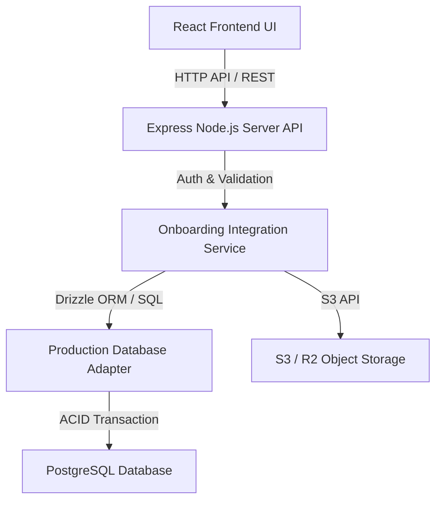

# ADR-001: Production Persistence Architecture & Database Stack Decision

* **Status:** UPDATED (Phase 10.7B Baseline Locked)
* **Date:** 2026-09-13
* **Author:** Advanced Agentic Coding Team
* **Target Domain:** Studio Onboarding, Production Configuration, Asset Metadata, Integration Receipts, Idempotency

---

## 1. Context & Architectural Requirements

The **AJ AI Studio Platform** (with **AKK Photo Studio** as the initial pilot tenant) operates a high-performance Express server (`server.ts`) for Gemini AI slip OCR verification and static asset serving, while utilizing `localStorage` and `DevelopmentMemoryProductionAdapter` for client onboarding drafts and Phase 10.6 integration transaction simulations.

To prepare the application for durable production deployment, we design a relational persistence architecture that replaces temporary development adapters without weakening the Phase 10.6 transaction and idempotency boundaries.

---

## 2. Decision: Database Stack & Ownership Boundary

### 2.1 Selected Baseline Stack: **PostgreSQL + Drizzle ORM + Express Application Service**

We select **PostgreSQL** paired with **Drizzle ORM** (using the native `postgres` ESM driver) managed exclusively through the **Express Application Service API**.

#### Why PostgreSQL + Drizzle ORM:
1. **Relational Integrity & Complex Schemas:** Studio configurations, packages, spaces, payment methods, booking rules, and invoice profiles are deeply relational and benefit from strong foreign key constraints and schema enforcement.
2. **ACID Multi-Table Transactions:** Integration apply requires multi-table atomic transactions (`BEGIN` $\rightarrow$ `UPSERT` 7+ tables $\rightarrow$ `COMMIT`). PostgreSQL provides native ACID transaction isolation.
3. **Database-Level Idempotency Protection:** PostgreSQL supports `UNIQUE` index constraints on `idempotency_key`, guaranteeing that simultaneous or repeated apply requests are safely deduplicated at the database engine level.
4. **Developer Ergonomics & Type Safety:** Drizzle ORM provides zero-overhead TypeScript type safety that mirrors our canonical models directly into SQL schemas.
5. **Portability & Ownership:** Runs locally via Docker/PostgreSQL in development, and deploys portably to managed PostgreSQL (Supabase, AWS RDS, Cloud SQL, Neon, or Railway) in production without vendor lock-in.

### 2.2 Migration Execution Strategy (Architecture Correction A)
- Production schema migrations are **NOT** executed automatically as application server-boot mutations.
- **Controlled Migration Architecture:** Migrations are version-controlled SQL files generated via Drizzle Kit (`npm run db:generate`) and executed via explicit deployment/staging migration commands (`npm run db:migrate`).
- Server startup may verify schema compatibility or database connectivity, but MUST NOT silently mutate production schemas on boot.

---

## 3. Data Ownership & API Authority Boundary



### Strict Rules:
1. **No Direct UI DB Access:** Frontend React components NEVER issue direct SQL queries, Drizzle imports, or database mutations.
2. **Server Authorization:** All configuration integration endpoints (`POST /api/onboarding/:projectId/integration/apply`) require authenticated server-side session/JWT tokens.
3. **Immutability of Onboarding Source:** Onboarding submission snapshots (`submission_snapshots`) remain historical import source records. Production settings (`studio_profiles`, `booking_packages`, etc.) are written into distinct operational tables.

---

## 4. Production Data Model & Technical Policies

### Operational Production Tables
- `studios`: Primary studio root (`id` UUID PK, `slug` VARCHAR UNIQUE, `displayName`, `status`, `createdAt`, `updatedAt`).
- `studio_profiles`: `studioId` UNIQUE FK (RESTRICT), name, address, phone, email, googleMapsUrl, logoAssetId, openingHours, closedDays (JSONB).
- `booking_packages`: `studioId` FK (RESTRICT), `sourcePackageId`, name, `price` (`bigint` MMK base units), `currency`, `depositType` ('NONE' | 'FIXED' | 'PERCENTAGE'), `depositValue` (`bigint`), `refundablePolicy`, `sessionDurationMinutes`, `includedItems` (JSONB), `retouchedPhotoCount`, `enabled`, `sortOrder`. Unique on `(studioId, sourcePackageId)`.
- `studio_spaces`: `studioId` FK (RESTRICT), `sourceSpaceId`, name, primaryUse, approximateSize, floorPlanAssetId, sketchAssetId, enabled, sortOrder. Unique on `(studioId, sourceSpaceId)`.
- `studio_space_assets`: Explicit relation table (`spaceId` FK CASCADE, `assetId`, `role`, `sortOrder`).
- `payment_configurations`: `studioId` UNIQUE FK (RESTRICT), `defaultDepositType`, `defaultDepositValue` (`bigint`), `defaultRefundablePolicy`, `remainingBalanceTiming`.
- `payment_methods`: `paymentConfigId` FK CASCADE, `studioId` FK RESTRICT, `sourcePaymentMethodId`, provider, accountName, accountIdentifier, qrAssetId, enabled. Unique on `(studioId, sourcePaymentMethodId)`.
- `booking_rules`: `studioId` UNIQUE FK (RESTRICT), `openingTime` (wall clock string e.g. "09:00"), `closingTime`, `defaultSessionDurationMinutes`, `bufferMinutes`, `closedDays` (JSONB), `maxAdvanceBookingDays`, `sameDayBooking`, policies.
- `invoice_profiles`: `studioId` UNIQUE FK (RESTRICT), `useStudioProfile`, `studioName`, `address`, `phone`, `logoAssetId`, `businessInfo`, `taxInfo`, `footerMessage`.
- `asset_records`: `studioId` FK RESTRICT, `sourceAssetId`, category, mimeType, `fileSizeBytes` (`bigint`), width, height, storageProvider, `storageKey` (backend-only), uploadStatus. Unique on `(studioId, sourceAssetId)`.

### Integration Audit & Uniqueness Tables
- `integration_runs`: `id` UUID PK, `integrationId`, `idempotencyKey` VARCHAR UNIQUE, `studioId` FK, `projectId`, `approvedSubmissionId`, `submissionVersion`, `schemaVersion`, `mapperVersion`, `status` ('STARTED' | 'COMMITTED' | 'ROLLED_BACK' | 'FAILED'), `operationCount`, `actorUserId`, `startedAt`, `completedAt`, `errorCode`, `errorMessage`.
- `integration_operation_records`: `integrationRunId` FK CASCADE, `sequence`, `operationId`, `operationType`, `targetKey`, `sourceId`, `status`, `errorCode`. Unique on `(integrationRunId, sequence)`.

### Technical Policies
- **Money Storage Policy:** Money amounts (MMK) are stored as `bigint` integer base units. Floating-point types are strictly forbidden for money.
- **Timestamp Policy:** System event timestamps (`createdAt`, `updatedAt`, `startedAt`, `completedAt`) use PostgreSQL `timestamptz`. Studio-local wall clock rules use explicit string representations (e.g. `"09:00"`).
- **Foreign Key Delete Policy:** Audit and studio configuration root records use `ON DELETE RESTRICT` to prevent accidental cascading deletion of historical audit logs. Child entities (such as space asset join rows or payment methods) use `ON DELETE CASCADE` from their parent configuration records.

---

## 5. Stable Provenance & Upsert Strategy

To prevent duplicate record creation during retries:
- **Studio Profile:** Keyed by `studio_id`.
- **Booking Package:** Upserted using `(studio_id, source_package_id)`.
- **Studio Space:** Upserted using `(studio_id, source_space_id)`.
- **Payment Method:** Upserted using `(studio_id, source_payment_method_id)`.
- **Asset Metadata:** Keyed by `(studio_id, source_asset_id)`.

Display names are never used as primary identifiers.

---

## 6. Atomic Transaction & Idempotency Execution Flow

```
1. Express Server receives POST /api/onboarding/:projectId/integration/apply
2. Authenticate actor & verify admin/owner role
3. Calculate plan & deterministic idempotencyKey
4. BEGIN PostgreSQL Transaction
5. Attempt INSERT INTO integration_runs (idempotency_key, status='STARTED')
   -> ON CONFLICT (idempotency_key):
      SELECT existing run from integration_runs
      ROLLBACK & Return ALREADY_APPLIED receipt
6. Execute UPSERT operations 1..N for Studio Profile, Packages, Spaces, Payments, Rules, Invoice, Assets
7. UPDATE integration_runs SET status='COMMITTED', completed_at=NOW()
8. UPDATE onboarding_projects SET status='INTEGRATED' WHERE approved_submission_id = target_submission_id
9. COMMIT Transaction
10. Return 200 OK with IntegrationReceipt
```

If any step fails, PostgreSQL performs an **atomic `ROLLBACK`**. `integration_runs` records `status='ROLLED_BACK'`, and `project.status` remains `APPROVED`.

---

## 7. Asset Storage & Binary Safety

- **Database:** Stores metadata only (`asset_id`, `category`, `mime_type`, `file_size_bytes`, `storage_provider`, `storage_key`, `upload_status`).
- **Binary Files:** Stored in S3-compatible Object Storage (AWS S3 or Cloudflare R2).
- **Security:** Private `storage_key` is never exposed directly in client UI objects. Base64 strings are strictly forbidden in database tables.

---

## 8. Payment Configuration Security

- Persists gateway parameters (`provider`, `accountName`, `accountIdentifier`, `qrAssetId`, `depositRules`).
- **NO OCR results** or transient slip verification details are saved into payment configuration tables.
- **NO passwords, PINs, OTPs, or API secrets** are stored in onboarding or configuration databases.

---

## 9. Backup & Disaster Recovery Architecture (Architecture Correction B)

- **Continuous Database PITR:** Managed PostgreSQL provider continuous Point-In-Time Recovery capability enabled where supported.
- **Scheduled Backups & Snapshots:** Daily automated logical/physical database backups stored in isolated secondary storage locations.
- **Restoration Procedures:** Documented and periodically tested database restoration workflows.
- **Object Storage Resiliency:** Binary object storage versioning and cross-region replication enabled separately from database backups.

---

## 10. LocalStorage Migration Map

| Key / Purpose | Current Type | Destination Strategy |
| :--- | :--- | :--- |
| `nocturne-atmosphere` | UI Preference | Keep in `localStorage` (Client UI preference) |
| `nocturne-workspace-view` | UI Preference | Keep in `localStorage` (Client UI preference) |
| `akk_theme_palette` | UI Preference | Keep in `localStorage` (Client UI preference) |
| `akk_studio_onboarding_project_v1_...` | Development Draft | Migrate to `onboarding_drafts` PostgreSQL table when backend auth lands |

---

## 11. Staged Implementation Roadmap

- **Phase 10.7A (COMPLETED):** Architecture Audit & Decision Record (ADR-001).
- **Phase 10.7B (COMPLETED):** Local PostgreSQL Docker setup, Drizzle ORM schemas, and version-controlled SQL migration scripts.
- **Phase 10.7C:** Server-side `ProductionDatabaseAdapter` implementation.
- **Phase 10.7D:** Server API integration endpoints (`POST /api/onboarding/:projectId/integration/apply`) & RBAC middleware.
- **Phase 10.7E:** Controlled Staging Integration Testing.
- **Phase 10.7F:** Production Readiness & Security Audit.
